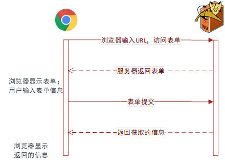
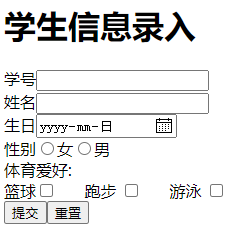
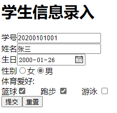
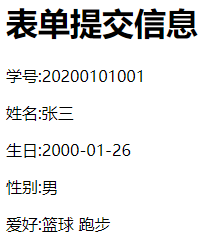
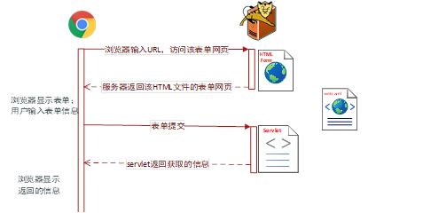
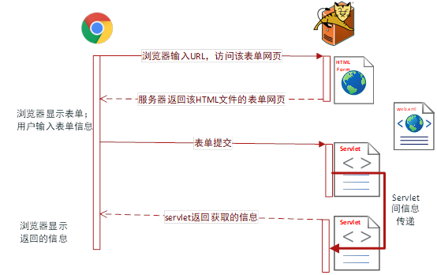
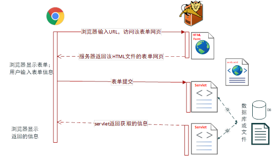

# 项目1：基于Servlet的学生信息获取与显示

## 项目基本功能

浏览器输入访问项目的URL访问服务器，服务器返回一个输入学生信息的表单网页，用户输入信息提交给服务器，服务器返回用户刚刚在表单网页中输入的信息。

### 用户界面

#### 输入信息的的表单界面

#### 显示提交信息页面

## 项目实现方式一

该实现方式中，应用仅由一个HTML的表单页面和一个servlet文件构成，servlet文件不仅获取用户提交的表单信息，还将得到的表单信息构造为一个HTML页面内容的字符串，返回给浏览器显示。

问题及实现细节：应用要求分别采用get/post两种提交方法进行测试，请测试说明采用这两个不同的提交方法时，二者的差异；对于servlet中的代码编写有无差异，如何在servlet中编写尽可能少的代码，使得可以不用修改代码，就可以兼顾两种提交方法。

## 项目实现方式二

该实现方式中，应用由一个HTML的表单页面和两个servlet文件构成，其中一个servlet文件获取用户提交的表单信息，另一个servlet构成返回浏览器的字符串信息，两个servlet间的信息传递直接通过编程在Web容器内进行传递。

问题及实现细节：servlet将间如何在Web应用系统内传递通过信息以及servlet间进行跳转，共有几种方式，分别修改代码进行测试，并说明它们间的区别。

## 项目实现方式三

该实现方式中，应用由一个HTML的表单页面和两个servlet文件构成，其中一个servlet文件获取用户提交的表单信息，另一个servlet构成返回浏览器的字符串信息，但两个servlet间的信息传递，不在Web容器内进行，而需要借助与外部进行，如通过文件或数据库的保存/读写进行传递。

## 项目实践结果提交

- 1）所有程序源代码提交在Github库中；

- 2）项目的每一项测试结果进行截图，提交在超星学习通中；

- 3）项目完成书写项目实践报告。报告包括：
  - （1）代码整体介绍说明；

  - （2）程序测试结果说明和分析；

  - （3）项目设计编码调试过程的遇到的问题以及解决方法。

    
